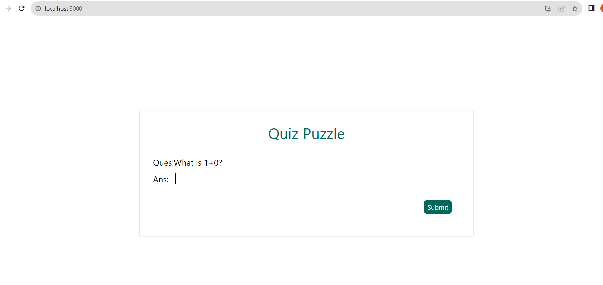
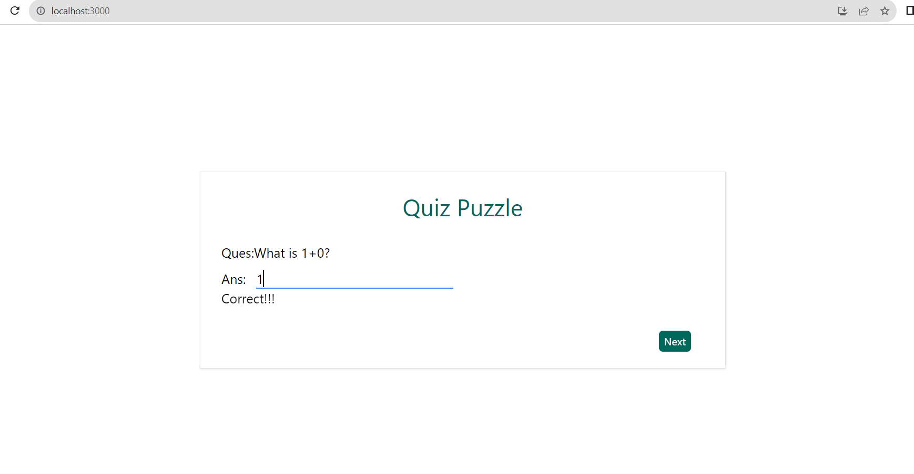
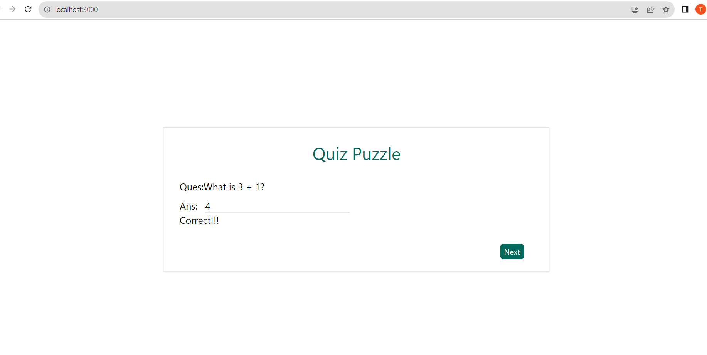

<h3>Run Node Server</h3>

npm install

node server.js

<h3>Running React App</h3>

cd quiz-concurrent-app

npm install

npm start

***As concurrent server behaviour, multiple clients and multiple requests can be progressed at same time***
